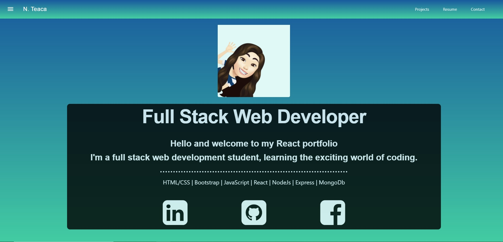

  #  React Portfolio
  
  
  
  
  
  ## Description
    This is a portfolio webpage designed in React  
    
  ## Table of Contents
  * [Installation](#installation)
  * [Usage](#usage)
  * [Demo](#demo)
  * [Credits](#credits)
  * [License](#license)
  * [Contributors](#contributors)
  * [Tests](#tests)
  * [Questions](#questions)
  
   ## Installation
     Steps to install the program are: npm install, npm start
 
   
  ## Usage
  Example and instrution of use: none

  ## Demo
   /

  [GitHub](https://github.com/natka58/react-portfolio)  /

  [Live URL](https://natka58.github.io/react-portfolio/)

  
  ## Credits
   Program collaborators and third party assets: No Collaborators used
  
 ## License
    MIT
  
  ## Contributors
   Quidelines to contributors: undefined

  ## Tests
   To test run the following code: No test 
  
    
  ## Questions
  
 GitHub Username: https://github.com/natka58 
  
E-mail: lilikoy@sbcglobal.net.